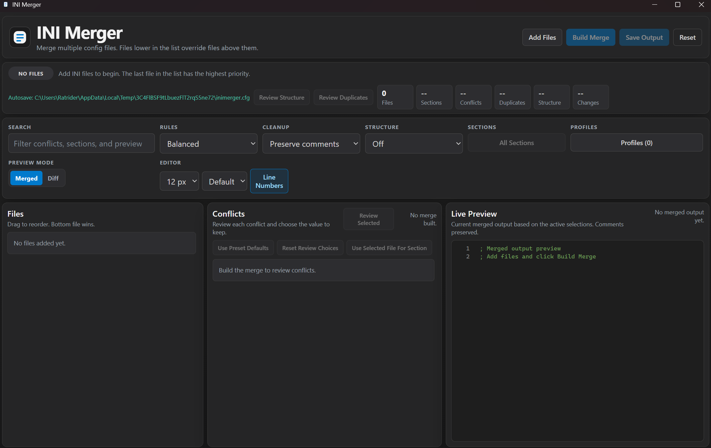

# INI Merger



INI Merger is a desktop Electron utility for combining Unreal-style INI files into a single output while keeping file precedence explicit. It includes grouped conflict review, duplicate review, searchable output, section filtering, rule presets, automatic session persistence, cleanup controls, structural validation, console-variable categorization, and a live merged preview in a VS Code-like dark UI.

## Highlights

- Secure Electron setup with `contextIsolation`, a preload bridge, and blocked external navigation
- Drag-to-reorder file stack so precedence is visible and editable
- N-way scalar conflict review with sequential modal walkthrough
- Duplicate detection with keep/remove decisions before export
- Search and filter across conflicts, sections, and preview text
- Section-only merge support through an include/exclude filter
- Rule presets for highest-priority, base-first, or preserve-all duplicate defaults
- Smart cleanup modes for stripping standalone comment blocks, excess whitespace, and optionally inline comments
- Structural validation and cleanup for loose non-INI lines, unverified Unreal sections, and first-pass section-placement hints
- Bulk duplicate actions for removing or preserving every duplicate group in one step
- Optional ConsoleVariables categorization that groups large flat cvar lists into readable topic blocks without changing the section itself
- Editor-style preview with line numbers, syntax coloring, adjustable font size, and adjustable line spacing
- Autosaved app state in `inimerger.cfg` beside the executable, including the last file stack and review choices
- Saved session profiles that store file paths, filters, rules, preview settings, and review choices
- Diff preview against the preset-driven default merge
- Bulk conflict actions, including section-wide file application
- Comment and blank-line preservation around parsed settings
- Live merged preview that updates as review choices, cleanup mode, and duplicate handling change
- Portable Windows build output through `electron-builder`

## Workflow

1. Add one or more INI files.
2. Reorder files so lower files override higher ones.
3. Click `Build Merge`.
4. Search, filter sections, choose cleanup/structure modes, optionally categorize `[ConsoleVariables]`, or change the active rule preset if needed.
5. Review conflicts if multiple scalar values exist.
6. Review duplicates if matching entries were collapsed.
7. Save the merged output or store the session as a reusable profile.

The app automatically writes `inimerger.cfg` beside the executable and restores the last session on launch when the referenced source files are still available.

## Project Structure

- `main.js`: Electron window lifecycle, IPC handlers, navigation guards
- `preload.js`: minimal renderer API bridge
- `index.html`: app shell and modal structure
- `styles.css`: VS Code-inspired dark theme and responsive layout
- `src/core/merge-engine.js`: parser, merge model, serialization, cleanup modes, section filtering, and review selection
- `src/core/console-variable-tools.js`: safe ConsoleVariables categorization and topic grouping helpers
- `src/renderer/app.js`: renderer state, autosave restore, structural validation, search/filtering, profiles, preview modes, and modal flows
- `test/merge-engine.test.js`: merge engine coverage
- `test/console-variable-tools.test.js`: ConsoleVariables categorization coverage
- `build/icon.png` and `build/icon.ico`: source icons for the packaged app
- `CHANGELOG.md`: release history

## Development

### Prerequisites

- Node.js 18 or newer
- npm

### Install

```bash
npm install
```

### Run

```bash
npm start
```

### Test

```bash
npm test
```

### Build Portable EXE

```bash
npm run dist
```

The portable executable is written to `dist/INIMerger-<version>.exe`.

## Notes

- The renderer only gets file open/save capabilities through `preload.js`.
- External web navigation and new windows are blocked by the main process.
- Repeatable Unreal-style entries are handled separately from scalar conflicts.
- Autosaved state is stored in `inimerger.cfg` beside the portable executable.
- Profiles are stored in the same app config file so they move with the portable build.

## License

This project is licensed under the MIT License. See `LICENSE`.
